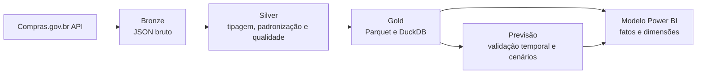
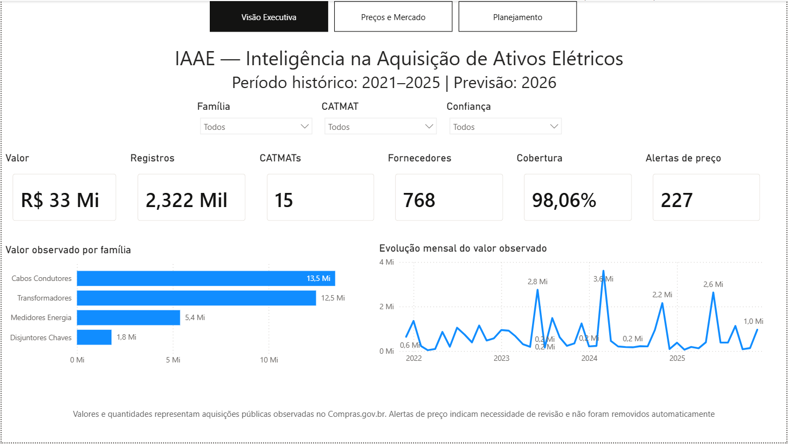
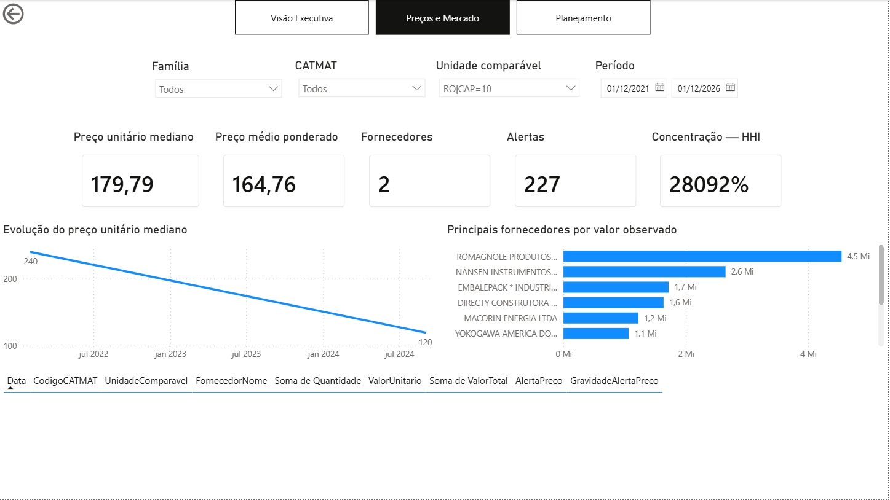
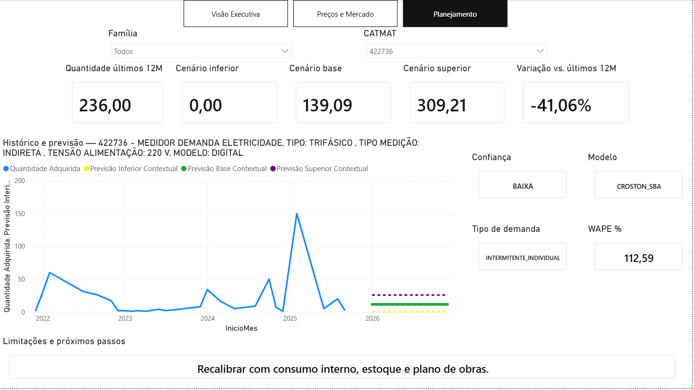

# IAAE — Inteligência na Aquisição de Ativos Elétricos

Projeto de engenharia e análise de dados que transforma compras públicas de materiais elétricos em referências de preço, indicadores de fornecedores, alertas de qualidade e cenários de planejamento.

> Projeto pessoal de portfólio construído com dados públicos do Compras.gov.br. Não representa solução oficial, consumo interno ou necessidade de compra de qualquer empresa.

## Resultado do PMV

A versão consolidada utiliza dados de 2021 a 2025 e contém:

- **4 famílias** de materiais elétricos;
- **15 CATMATs** validados;
- **2.322 registros** de compras públicas;
- **R$ 33,13 milhões** em valor observado;
- **1,96 milhão** de unidades observadas;
- **768 fornecedores**, **719 UASGs** e **27 UFs**;
- **540 linhas de previsão**: 15 CATMATs × 12 meses × 3 cenários;
- cenários **inferior, base e superior** para 2026.

As famílias finais são Cabos Condutores, Transformadores, Medidores Energia e Disjuntores Chaves.

## O que o projeto demonstra

- consumo de API pública com paginação, tolerância a falhas e rastreabilidade;
- arquitetura Bronze, Silver e Gold;
- padronização de CATMAT, unidades e campos de compra;
- regras de qualidade, duplicidade e alerta de preço;
- modelagem estrela para Power BI;
- previsão de séries intermitentes com validação temporal;
- integração e publicação controlada dos arquivos analíticos;
- testes automatizados e integração contínua.

## Arquitetura



A `FatoCompras` e a `FatoPrevisao` não se relacionam diretamente. As análises convergem pelas dimensões de material e calendário.

## Dashboard

O arquivo final está em [`dashboard/IAAE_Dashboard_Final.pbix`](dashboard/IAAE_Dashboard_Final.pbix) e possui três páginas:

1. **Visão Executiva** — cobertura, valor, volume, qualidade e evolução;
2. **Preços e Mercado** — referências comparáveis, dispersão, fornecedores e HHI;
3. **Planejamento** — histórico, previsão, cenários, confiança e limitações.

### Visão Executiva



### Preços e Mercado



### Planejamento



O PBIX contém um snapshot importado. Para atualizar os dados em outro computador, gere os arquivos de `data/powerbi` e ajuste a origem das consultas para a pasta local do repositório. Consulte [`dashboard/README.md`](dashboard/README.md).

## Requisitos

- Python **3.14**;
- Git;
- Power BI Desktop apenas para abrir ou atualizar o dashboard;
- Windows recomendado para os scripts PowerShell de automação.

## Instalação

### Windows / PowerShell

```powershell
git clone https://github.com/joao-sf/IAAE.git
cd IAAE
Set-ExecutionPolicy -Scope Process Bypass
.\scripts\setup_vscode.ps1
```

### Instalação manual

```bash
python -m venv .venv
```

No Windows:

```powershell
.\.venv\Scripts\Activate.ps1
python -m pip install --upgrade pip
python -m pip install -e ".[dev]"
Copy-Item .env.example .env
```

Em Linux ou macOS:

```bash
source .venv/bin/activate
python -m pip install --upgrade pip
python -m pip install -e ".[dev]"
cp .env.example .env
```

## Verificações rápidas

```bash
python main.py smoke-test --code 610532
python main.py price-smoke-test --code 610539 --uasg 986001 --page-size 10
```

## Execução do pipeline principal

```bash
python main.py run \
  --start-date 2021-01-01 \
  --end-date 2025-12-31 \
  --catalog-file config/catmat_eletricos.csv
```

Para reconstruir a Gold a partir da Silver já existente:

```bash
python main.py rebuild \
  --catalog-file config/catmat_eletricos.csv \
  --silver-file data/silver/precos_praticados.parquet
```

As rotinas especializadas de análise, previsão e preparação do modelo estão documentadas em [`docs/REPRODUCAO.md`](docs/REPRODUCAO.md).

## Qualidade

```bash
python -m ruff check .
python -m ruff format --check .
python -m pytest --cov=src --cov-report=term-missing
python scripts/validar_repositorio_publico.py
```

## Estrutura

```text
config/       CATMATs, famílias e parâmetros de modelagem
src/          cliente de API, transformação, qualidade e persistência
scripts/      análises, previsão, integração, auditoria e publicação
tests/        testes automatizados
docs/         arquitetura, dados, previsão e reprodução
dashboard/    arquivo Power BI final
data/         somente amostra e diretórios de saída ignorados pelo Git
```

## Limitações

- compras públicas não equivalem ao consumo físico de uma distribuidora;
- descrições CATMAT podem representar especificações distintas;
- preços só são comparáveis quando CATMAT, unidade e capacidade são compatíveis;
- alertas de preço indicam necessidade de investigação, não sobrepreço automático;
- a previsão representa demanda pública observada e não substitui estoque, consumo interno, criticidade ou plano de obras.

## Documentação

- [Arquitetura](docs/ARQUITETURA.md)
- [Metodologia de previsão](docs/METODOLOGIA_PREVISAO.md)
- [Modelo de dados do Power BI](docs/MODELO_DADOS_POWERBI.md)
- [Dicionário de dados](docs/DICIONARIO_DADOS.md)
- [Reprodução do projeto](docs/REPRODUCAO.md)
- [Portabilidade do Power BI](docs/POWER_BI_PORTABILIDADE.md)
## Licença

MIT. Consulte [`LICENSE`](LICENSE).
