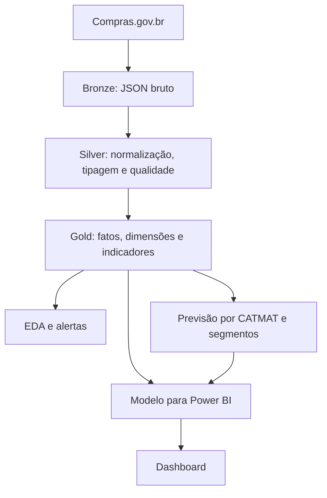

# Arquitetura do IAAE

## Fluxo principal

## Bronze

Preserva respostas brutas da API por CATMAT e página. Essa camada permite auditoria, reprocessamento e investigação de mudanças no esquema da fonte.

## Silver

Executa:

- tipagem de datas e valores;
- padronização de CATMAT;
- normalização de fornecedor, UASG e UF;
- criação de unidade comparável;
- identificação de chaves e registros potencialmente duplicados;
- persistência em Parquet.

## Gold

Consolida:

- fato de compras;
- dimensão de materiais;
- relatórios de qualidade;
- alertas de preço;
- indicadores de fornecedores;
- séries temporais e previsões;
- banco analítico DuckDB.

## Modelo Power BI

O relatório usa duas tabelas fato:

- `FatoCompras`: histórico observado;
- `FatoPrevisao`: projeção mensal por CATMAT e cenário.

As fatos não possuem relacionamento direto. Elas convergem por `DimMaterial` e `DimCalendario`, evitando mistura de granularidade.

## Publicação controlada

A integração dos medidores é construída primeiro em staging. O processo valida esquema, contagem, CATMATs, cenários, UF e preservação das demais famílias. Somente um staging aprovado pode substituir os Parquets de produção, com backup e comparação de hashes.
